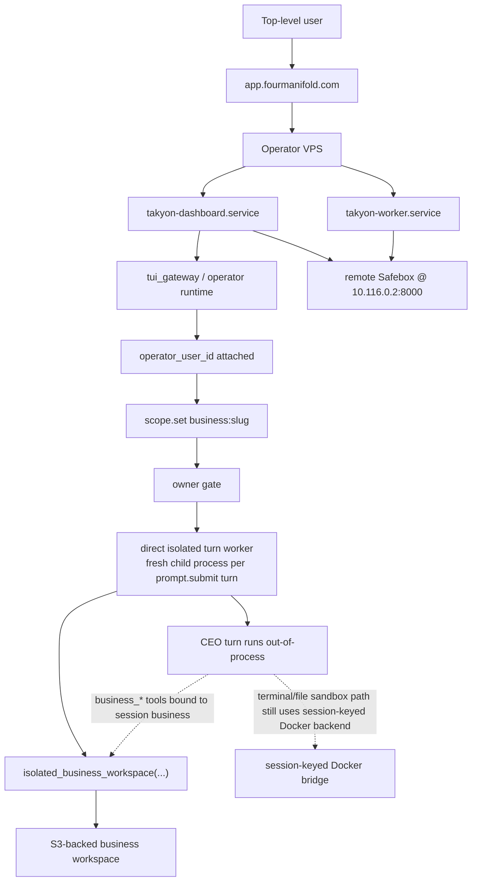
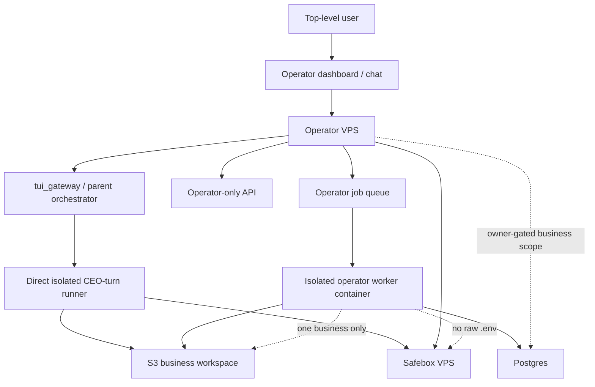
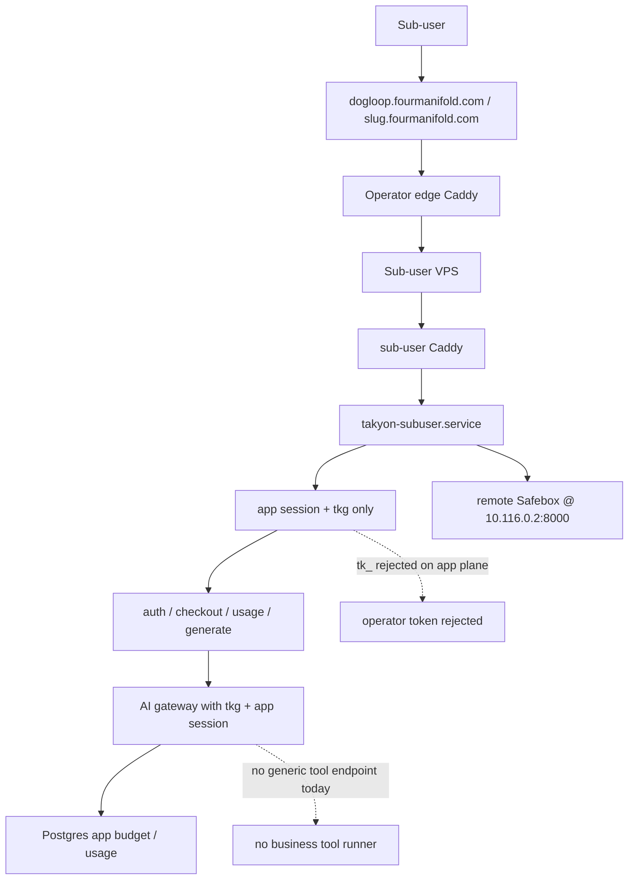
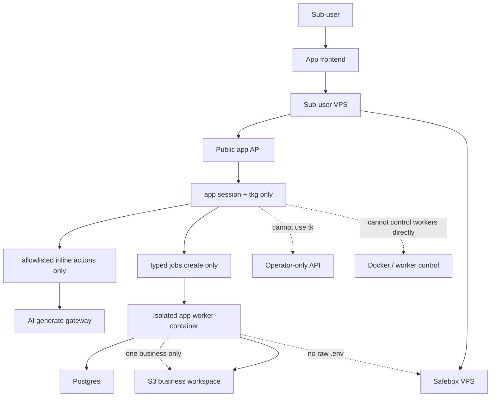

# Safety Plan

This file is the source of truth for the isolation rollout. Before changing runtime topology, auth, worker routing, or secret handling, check this file and make sure the change still matches the target here.

## Goal

We want all of the following at once:

1. Top-level users must not be able to read, write, or induce writes into other owners' businesses.
2. Sub-user apps must not gain general tool or filesystem authority.
3. Safebox must remain the only secret/funding authority and must not be embedded into each worker.
4. We must lose no current product capability:
   - top-level operator chat / CEO turns
   - wallet / billing / payouts
   - generated-app auth / checkout / usage / AI generate
   - long-running business jobs
   - business workspace durability

## Current Truth

### Rollout status as of 2026-06-03

- Existing operator droplet confirmed: `ubuntu-s-2vcpu-4gb-120gb-intel-nyc1` at `137.184.75.57` in `NYC1` on VPC `default-nyc1`.
- New Safebox droplet created: `takyon-safebox` (`1 GB / 1 vCPU / 25 GB`, droplet id `574885009`, public `67.205.158.170`, private `10.116.0.2`) in the same `NYC1` / `default-nyc1` network.
- New sub-user droplet created: `takyon-subuser` (`4 GB / 2 AMD vCPU / 80 GB`, droplet id `574885454`, public `134.209.123.8`, private `10.116.0.3`) in the same `NYC1` / `default-nyc1` network.
- Dedicated firewall objects created:
  - existing operator firewall: `argon-alpha`
  - new Safebox firewall: `takyon-safebox-fw`
  - new sub-user firewall: `takyon-subuser-fw`
- Firewall hardening now matches the intended public/private split:
  - `argon-alpha`: `SSH 22` from `73.63.144.229/32`, `HTTP 80` public, `HTTPS 443` public
  - `takyon-safebox-fw`: `SSH 22` from `73.63.144.229/32`, `TCP 8000` from private VPC CIDR `10.116.0.0/20`
  - `takyon-subuser-fw`: `SSH 22` from `73.63.144.229/32`, `HTTP 80` public, `HTTPS 443` public
- Code now contains the first split-plane enforcement pieces:
  - app-plane routes explicitly reject `tk_` owner tokens
  - Safebox has a dedicated service app (`plugins/takyon/safebox_app.py`)
  - Safebox callers can switch from in-process authority to remote HTTP authority through `TAKYON_SAFEBOX_URL`
  - `takyon_cli.web_server` now supports explicit host roles via `TAKYON_HOST_ROLE=combined|operator|subuser`
  - `subuser` role serves only product hosts plus app-runtime rails and rejects dashboard/operator chat surfaces
  - `operator` role rejects product hosts and public app-runtime routes
  - the tracked operator services now set `TERMINAL_ENV=docker` and `TERMINAL_DOCKER_MOUNT_CWD_TO_WORKSPACE=true`
  - the existing tool Docker backend now uses the gateway session key as its sandbox key and prefers the session workspace root as cwd, so scoped operator shell/file tools stop sharing one global default container
  - tracked deploy/service assets now exist for all three planes:
    - `deploy/argon-alpha-14/*`
    - `deploy/takyon-subuser/*`
    - `deploy/takyon-safebox/*`
- Live split status is now partially cut over:
  - `takyon-safebox.service` is live on `67.205.158.170` and healthy on private `10.116.0.2:8000`
  - operator `takyon-dashboard.service` and `takyon-worker.service` point at remote Safebox with `TAKYON_SAFEBOX_URL=http://10.116.0.2:8000`
  - `app.fourmanifold.com` is back to the expected Auth0-gated operator flow (`302 /auth/login` at the public root)
  - `takyon-subuser.service` is live on `134.209.123.8`
  - the tracked sub-user Caddyfile is live on `134.209.123.8`
  - the existing `product-sites` tree has been synced from the operator host to the sub-user host, and public/shared product hosts now terminate on the operator edge and proxy over the private VPC to the sub-user plane; `https://dogloop.fourmanifold.com/` now returns the real product HTML through that path
- `.github/workflows/deploy.yml` now has optional Safebox/sub-user deploy steps when their host secrets are configured
- `.github/workflows/deploy.yml` now probes SSH reachability first and skips unreachable remote deploy steps instead of failing the whole push when GitHub-hosted runners are outside the local-only firewall allowlist
- Honest current gap: the repo/runtime split is now live for operator Auth0/Safebox and for public/shared product hosts through the dedicated sub-user plane. The remaining top-level gap is now split in two:
  - repo/code: interactive operator turns now use a fresh isolated child runner instead of the shared live process
  - live/deploy: production does not get that new turn-runner path until the next operator VPS deploy
  - longer-term hardening: this is still a fresh process on the operator host, not yet a per-turn Docker container, and product hosts still terminate on the operator edge first

### Business files

- Durable business workspace bytes are already S3-backed through `supabase_s3`.
- Runtime execution still materializes one business into local scratch while it runs.
- The seam for this already exists in `hermes-agent-main/plugins/takyon/storage.py` via `isolated_business_workspace(...)`.

### Top-level operator path

- The main top-level path is not `/v1`. It is dashboard chat into `tui_gateway`.
- `session.create` attaches `operator_user_id`.
- Business scope changes are owner-gated.
- Business-scoped CEO turns already run inside `isolated_business_workspace(...)`.
- In a scoped turn, `business_*` tools are bound to `TAKYON_SESSION_BUSINESS_SLUG`, so an agent in `business:alpha` cannot pass `business=beta` and escape to another business in the same session.
- Business file writes also resolve through the canonical business-root containment checks, so output paths cannot escape the current business root.
- The primary Agent SDK session reaches business files only through the reviewed HANDOFF tool allowlist and canonical business-root containment checks; it cannot spawn a nested model worker.
- Safebox is live as a separate service now; the remaining gap on this plane is per-turn process/container freshness, not raw shared-secret reads through in-process Safebox.

### Sub-user app path

- The sub-user app path is already a narrow backend surface:
  - `auth`
  - `checkout`
  - `usage`
  - `generate`
- `generate` goes through the app AI gateway and uses `tkg_` plus app session auth.
- There is no generic “call tool by name” app endpoint today.

### Token truth

- `tk_` = top-level owner authority.
- `tkg_` = business app gateway authority.
- `tk_` and `tkg_` must remain disjoint.
- If a malicious top-level owner pastes `tk_` into their app, that is an attack surface against that owner's own operator authority unless the sub-user plane refuses `tk_`.

## Target Architecture

We split the system into three planes.

### 1. Safebox Plane

- One logical Safebox service per environment.
- Not one Safebox per worker.
- Not one Safebox per user.
- Operator and sub-user planes call it over a narrow service interface.
- Workers never receive raw platform secrets.

### 2. Operator Plane

- Host: `app.fourmanifold.com`
- Purpose: top-level dashboard, `tui_gateway`, CEO/operator chat, operator billing surfaces.
- Rule: business-scoped mutation and long-running work must go through isolated Docker workers.
- Shared operator process may orchestrate, inspect, read, and enqueue; it should not be the steady-state place where business filesystem mutation happens.

### 3. Sub-user Plane

- Host: product/business hosts such as `slug.fourmanifold.com` plus product app API surfaces.
- Purpose: app auth/session/checkout/usage/AI generate plus typed job enqueue/status.
- Rule: no general tools here.
- Rule: no `tui_gateway`, no `/api/ws`, no `/api/tui/rpc`, no generic shell, no generic business tool surface, no `/v1` owner API.

## Hard Rules

### No-tools rule for the `tkg_` plane

The sub-user plane must expose only narrow app/runtime actions:

- `auth.request`
- `auth.verify`
- `session.read`
- `account.read`
- `checkout.create`
- `usage.read`
- `usage.record`
- `ai.generate`
- `jobs.create`
- `jobs.status`

It must not expose:

- `tui_gateway`
- generic `business_*` tools
- shell/terminal
- generic file read/write APIs
- Docker control
- raw provider gateways intended for operators
- `/v1` owner endpoints

### Docker-only mutation rule for the top-level plane

Top-level users can still use the operator runtime normally, but:

- file-mutating business work
- builds
- publish/deploy actions
- long-running product/business jobs
- campaign work
- heavy agent tasks

must execute in an isolated worker container, not in the shared operator process.

### Token audience rule

- `tk_` is accepted only by the operator plane.
- `tkg_` is accepted only by the sub-user app plane.
- internal dashboard session tokens are accepted only by internal operator-only gateways.
- workers get a short-lived run token, not `tk_`, not `tkg_`, and not raw provider secrets.

## Worker Model

One job = one fresh container from a prebuilt image.

The image contains:

- worker code
- runtime dependencies

The job injects only:

- `business_slug`
- `job_id`
- short-lived run token
- one scratch Takyon home for exactly one business

The worker must not receive:

- raw `.env`
- Docker socket
- shared `.takyon`
- repo-root write access
- another business mount
- a public port

## VPS Topology

Minimum rollout target:

1. Existing operator VPS stays the operator plane.
2. Add one Safebox VPS.
3. Add one sub-user VPS.

Later scale-out:

- add more operator worker VPSes if needed
- add more sub-user worker VPSes if needed
- keep one logical Safebox service per environment

Do not run a separate full Safebox on every worker host.

## Firewall / Network Rules

### Safebox VPS

- Current enforced rule:
  - `SSH 22` from `73.63.144.229/32`
  - `TCP 8000` from `10.116.0.0/20`
- Public app ingress: none.
- Service traffic stays on the private network.

### Operator VPS

- Current enforced rule:
  - `SSH 22` from `73.63.144.229/32`
  - `HTTP 80` from `All IPv4` and `All IPv6`
  - `HTTPS 443` from `All IPv4` and `All IPv6`
- No public Docker API.

### Sub-user VPS

- Current enforced rule:
  - `SSH 22` from `73.63.144.229/32`
  - `HTTP 80` from `All IPv4` and `All IPv6`
  - `HTTPS 443` from `All IPv4` and `All IPv6`
- No public Docker API.

### All worker hosts

- no public Docker socket
- no worker control port exposed to the internet
- no direct secret file exposure

## Implementation Phases

### Phase 0. Freeze the contract

- Keep this file updated and use it as the rollout checklist.
- Do not add new broad tool surfaces to the sub-user plane.

### Phase 1. Provision network and VPS classes

- Keep the existing operator VPS.
- Provision:
  - one Safebox VPS
  - one sub-user VPS
- Place them on the same private network/VPC.
- Apply the firewall rules above before moving traffic.

### Phase 2. Extract Safebox

- Move Safebox from in-process module usage to a real service boundary.
- Keep one logical Safebox authority per environment.
- Operator plane and sub-user plane call Safebox over private network.
- Workers call operator/sub-user backends or Safebox narrow endpoints, not raw `.env`.

Current repo status:

- implemented in code and deploy assets
- verified live on the dedicated Safebox VPS

### Phase 3. Lock the sub-user plane

- Serve only:
  - auth/session/account
  - checkout/usage
  - AI generate
  - typed jobs API
- Reject `tk_` on the sub-user plane.
- Accept only `tkg_` plus app session semantics there.
- Keep no general tools on this host.

Current repo status:

- implemented in `web_server.py` through `TAKYON_HOST_ROLE=subuser`
- tracked sub-user service and Caddy config exist
- verified live on the dedicated sub-user VPS for local host-header routing
- public shared product hosts are now live through the tracked operator-edge proxy to the sub-user plane

### Phase 4. Move long/mutating sub-user tasks to isolated workers

- Add typed `jobs.create` actions for app-originated long/mutating work.
- Run each job in a one-business container.
- Sync one business from S3 to scratch, run, then sync back.

### Phase 5. Enforce Docker-only mutation on the operator plane

- Audit operator-facing mutating paths.
- Route all business-scoped writes and long-running work through isolated workers.
- Current repo status:
  - partially implemented through the existing terminal/file Docker backend on the tracked operator services
  - business-scoped file tools already bind to the current session business and current isolated workspace
  - the primary Agent SDK session uses guarded business-scoped file tools and the isolated terminal/build sandbox, with no nested model worker
  - remaining delta: ordinary scoped CEO turns still reuse the live operator process instead of always becoming one explicit fresh worker/container per turn
  - business-scoped CEO turns already run inside `isolated_business_workspace(...)`
  - remaining gap is to finish reducing non-terminal mutation paths to explicit isolated-worker semantics, not to invent a brand-new Docker backend
- Leave shared operator process with orchestration/read/enqueue duties.

### Phase 6. Add more compute without changing trust boundaries

- More operator worker VPSes:
  - drain operator job queue
  - call shared Safebox
- More sub-user worker VPSes:
  - drain sub-user job queue
  - call shared Safebox
- Do not duplicate secret authority onto each worker host.

Deploy note under the current firewall:

- GitHub-hosted runners can no longer SSH into the VPSes while `22` is restricted to `73.63.144.229/32`.
- The tracked workflow now skips unreachable remote deploy steps cleanly and still reports build/compile status.
- Full push-to-all-hosts automation therefore still depends on either a reachable deploy runner or a firewall change.

## Capability Preservation

We must preserve all of these:

- top-level CEO turns
- wallet / top-up / payouts / creative-credit purchase
- generated-app auth and app sessions
- generated-app checkout
- generated-app usage recording
- generated-app AI generate
- business-scoped long-running work
- S3-backed business workspace durability

## Acceptance Criteria

We are done only when all of these are true:

1. A sub-user app cannot call any generic tool or filesystem endpoint because none exist on that plane.
2. A `tkg_` token cannot authenticate to operator APIs.
3. A `tk_` token is rejected on the sub-user plane.
4. A worker container can only see one business workspace at a time.
5. Workers have no raw `.env`.
6. Safebox is not embedded into each worker host as a second mutable authority copy.
7. Top-level business mutations and long jobs execute through isolated workers, not the shared operator process.
8. Cross-owner business access is blocked both at scope resolution and at job/workspace execution time.

## Proof Graph: Current Top-Level Path

This is the current **repo/code** shape after the isolated-turn change. Live production matches this only after the next operator VPS deploy.

## Target Graph: Operator Plane

Refinement versus the original target: interactive CEO turns should be isolated direct calls rather than durable queued jobs-per-turn. Background work still uses the worker/job plane.

## Proof Graph: Current Sub-user Path

## Target Graph: Sub-user Plane

## Proof Graph Requirement

After each major phase, regenerate a proof graph from the live implementation and compare it to the target graphs above. Do not claim the architecture exists until the proof graph matches the deployed state.
