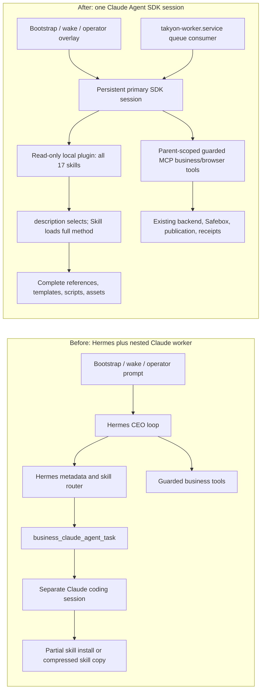

# Hermes to Claude Agent SDK Migration

## Goal

Replace Hermes model orchestration with one persistent Claude Agent SDK session while preserving
every approved skill's original routing, method, resources, tools, verification, and output
capability; keep the durable Takyon queue worker, Rails/backend rails, tenant boundaries, Safebox
spend authority, idempotency, publication, and sub-user plane unchanged.

## Non-negotiable result

- All 17 approved skills are installed once in one read-only local Agent SDK plugin and are available
  by default in bootstrap, interactive, and wake sessions.
- Claude chooses a skill from the standard `name` and `description` frontmatter; the description
  contains the skill's positive and negative "when to use" routing.
- Invoking `Skill` loads the complete `SKILL.md`; all original references, templates, scripts,
  assets, examples, licenses, and upstream provenance are published with it.
- No original skill capability is summarized away, moved into an unavailable archive, or replaced by
  a smaller Takyon-specific shell.
- The pinned Taste Skill is byte-for-byte the original `npx skills add Leonxlnx/taste-skill` bundle.
- Non-native Hermes skills use standard Agent Skills form without losing their original instructions.
- Product and mobile work runs directly in the primary Agent SDK session; no nested Claude worker,
  SDK subagent, `Agent` tool, `delegate_task`, or `business_claude_agent_task` remains.
- `takyon-worker.service` remains the durable queue consumer. It is execution infrastructure, not a
  second model agent.
- HANDOFF is documentation for future skill authors only. Runtime never reads it.
- Runtime-specific folder publication, mode tool policy, tenant scope, spend authority, receipts,
  idempotency, and completion predicates remain outside domain skills.
- No Rails/backend behavior is changed, stubbed, faked, hotfixed, or monkeypatched for proof.

## Before and after



## One-sentence answers

- **When the Agent SDK is called, are skills installed per call?** No; the release deploy installs one
  immutable plugin and every primary session starts with all 17 skills discoverable.
- **How are skills surfaced and ported?** Claude sees every skill's standard frontmatter `name` and
  `description` at startup, uses that description for autonomous routing, and loads the complete
  `SKILL.md` plus published resources only when invoked.
- **How is HANDOFF adjusted?** `skills/HANDOFF/POLICY.md` only teaches future authors the standard
  skill shape and where release/runtime policy belongs; it is not a binding file or runtime prompt.
- **Is the sub-user plane affected?** No; operator SDK code, plugin files, dependencies, state, and
  authority remain absent from both sub-user replicas.
- **Is security affected?** No boundary is weakened; the SDK child remains key-free and
  database-free, tools remain parent-scoped, cross-business calls fail closed, and subagents/shell
  remain disabled.
- **Are spend gates affected?** No; provider access still requires Safebox-minted capabilities and
  the existing operator, creative-credit, or sub-user usage reserve/settle rail.
- **Do we still spawn workers?** We no longer spawn model workers; the existing queue worker still
  claims durable jobs and starts the one primary SDK session because queue durability and agent
  delegation are different concerns.
- **Can the Mac still work production jobs?** Yes; `scripts/takyon-operator-prod.sh worker` remains the
  Mac-primary rail and the operator VPS worker remains the delayed fallback.
- **What happens to bootstrap and wake prompts?** Stable CEO policy remains in
  `plugins/takyon/prompts/ceo.md`; bootstrap, wake, and interactive overlays select the task mode and
  tool policy while resuming the same durable SDK transcript where appropriate.
- **What happens to skill receipts?** Normal tool/publication receipts remain; hard-coded
  phase-to-skill invocation receipts are not completion gates and skill-use auditing is external.
- **What happens to rendered design review?** Browser snapshot and native screenshot inspection are
  available to the primary session as a nonblocking craft loop; subjective design acceptance is not
  a publication gate.

## Correct Agent Skills form

```text
skills/<category>/<skill-name>/
  SKILL.md
  references/       # optional, preserve all original files
  templates/        # optional, preserve all original files
  scripts/          # optional, preserve all original files
  assets/           # optional, preserve all original files
  examples/         # optional, preserve all original files
```

```md
---
name: skill-name
description: What the skill does. Use when ... Do not use when ...
---

# Skill Name

The complete original workflow, tools, decisions, verification, examples, and failure behavior.
```

Only standard Agent Skills frontmatter belongs above the delimiter. Former Hermes routing fields are
migrated as follows:

| Hermes field | Agent SDK destination |
| --- | --- |
| `routing.owns` | Frontmatter `description` and the skill overview |
| `routing.when_to_use` | Frontmatter `description` and `## When to Use` |
| `routing.do_not_use_for` | Frontmatter `description` and `## When to Use` |
| Tool usage and procedure | Full `SKILL.md`; tool remains a guarded MCP capability |
| References/templates/scripts/assets | Same relative paths inside the published skill bundle |
| Related skill guidance | Skill body using canonical native skill names |
| Provider-key requirements | Guarded business tool plus truthful blocker; no key enters SDK child |
| Publication/output paths | Skill method describes the artifact; `release-skills.yaml` owns plugin paths and runtime owns authoritative publication |
| Mode restrictions | `skills/sdk-runtime-policy.yaml`, not skill routing |

## Source ownership

| Concern | Source of truth |
| --- | --- |
| Skill selection and "when to use" | Each native `SKILL.md` frontmatter description |
| Domain method and complete capability | Full skill folder |
| Approved skills and exact published files | `skills/release-skills.yaml` |
| Bootstrap/interactive/wake tool and write policy | `skills/sdk-runtime-policy.yaml` |
| Stable CEO behavior | `plugins/takyon/prompts/ceo.md` |
| Invocation overlay and phase sequencing | Bootstrap/wake/interactive runtime code |
| Tenant scope and ownership | Parent tool bridge and existing business handlers |
| Spend authority and provider keys | Safebox |
| Idempotency, receipts, publication, and hard completion truth | Existing runtime/backend code |
| Future skill authoring instructions | `skills/HANDOFF/POLICY.md` |

## Skill preservation audit

For each approved skill, the release must prove:

1. Its source folder is present in `release-skills.yaml`.
2. `publish_files` equals every real file in the source folder, excluding only generated bytecode.
3. Frontmatter contains a valid canonical `name` and a clear autonomous-routing `description`.
4. Positive and negative routing from Hermes remains in the description/body.
5. The full original procedure, examples, validation, failure behavior, and real tools remain.
6. Every original reference, template, script, asset, license, and provenance file is published.
7. No `${HERMES_SKILL_DIR}`, Hermes metadata dependency, or nested-agent call remains.
8. Any compatibility edit is mechanical: standard relative resource paths, direct primary-session
   execution, or guarded MCP tool naming.
9. Taste's folder digest matches the pinned pre-migration source exactly.
10. The published plugin digest matches the locked manifest and the plugin is read-only.

## Runtime behavior

The Agent SDK is launched with:

- one local plugin path;
- `skills: "all"`;
- native `Skill` enabled;
- the exact parent-scoped MCP tool allowlist for the invocation mode;
- `Agent`, subagent aliases, ambient settings, mutable skill discovery, and raw provider credentials
  disabled;
- a durable SessionStore for transcript persistence and resume;
- DeepSeek through a Safebox `operator.session` capability and bounded budgets;
- progress events that include epoch and useful sub-progress without inventing completion.

Every mode sees all skills. Mode policy limits side effects, not discovery, so Claude can reason from
the same skill catalog while the runtime still prevents bootstrap, wake, or interactive actions that
are outside that mode's authority.

## Gates retained versus removed

Retained hard boundaries:

- owner/business/session scope;
- cross-business refusal;
- allowed tools and denied write paths;
- Safebox spend authority and budget ceilings;
- idempotency/preclaim protection;
- SDK model/session/resume integrity;
- immutable approved plugin and resource allowlist;
- deterministic build/typecheck, authoritative publish status, URL, and real backend receipts.

Removed or externalized:

- `PHASE_REQUIRED_SKILLS` receipt enforcement;
- per-phase native-skill receipt completion predicates;
- subjective design/taste acceptance gates;
- whole-job retry because one bespoke brief predicate missed;
- nested Claude worker completion gates;
- active HANDOFF capability bindings.

Skill invocation and output quality are audited externally from transcripts, source changes, and the
live result; the audit does not become a permanent business completion predicate.

## Required implementation and proof

1. Restore and mechanically port all approved skill folders.
2. Compile and publish the exact immutable plugin.
3. Prove the SDK init event discovers exactly all 17 skills in bootstrap, interactive, and wake.
4. Prove the descriptions cause correct skill selection without a hard-coded phase-to-skill map.
5. Prove references/resources can be loaded and browser screenshot inspection reaches the primary
   session without a second ungated provider call.
6. Prove no model-agent or legacy Hermes delegation tool is registered or callable.
7. Run focused and relevant full CLI tests; do not use dashboard tests.
8. Push the tested outer-repo commit to `origin/main`; keep `origin/dev` an identical dormant mirror.
9. Deploy that exact commit through the tracked Mac production deploy script and verify operator
   services, source revision, SDK dependencies, plugin digest, Safebox connectivity, and health.
10. Verify both sub-user replicas still contain no operator SDK/plugin/authority material; deploy a
    sub-user plane only if its tracked code changed.
11. Run a fresh production CLI bootstrap plus real product workflow. Confirm Taste is invoked and the
    rendered result is inspected; return the real `https://<slug>.coscale.app` URL.
12. Exercise the X skill if its real credentials/authority are available. If only X is blocked,
    report the exact X blocker without blocking the fresh-business product proof.
13. Remove stale Hermes runtime files and generated state from local release paths and production
    through tracked deployment cleanup; do not rewrite Git history.

## Completion report format

The final report must include:

- commit and deployed revision;
- 17-skill inventory with source file count, published file count, routing status, and preservation
  result;
- pinned Taste digest comparison;
- tests and exact pass/fail counts;
- operator, Safebox, and sub-user isolation verification;
- CLI bootstrap/product job and public URL;
- transcript evidence for Taste and any other selected skills;
- X result or exact isolated blocker;
- explicit confirmation that Rails/backend behavior, tenant boundaries, security, and spend gates
  were not weakened;
- any unresolved defect stated directly.
