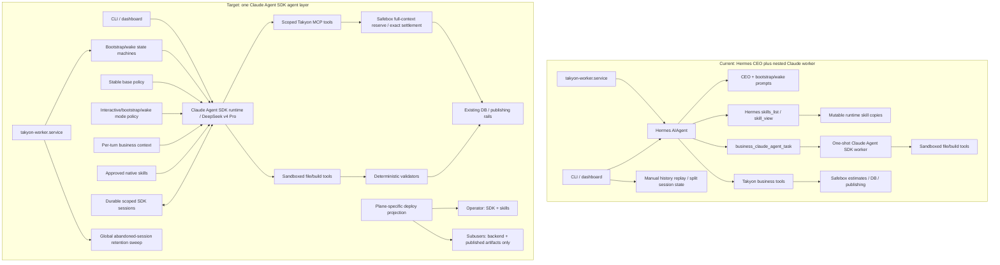

# Hermes to Claude Agent SDK Migration

## Decision

Yes: build from the existing Claude Agent SDK worker in `hermes-agent-main/scripts/takyon-claude-agent-task.mjs`, but refactor it from a nested, one-shot coding worker into Takyon's primary, session-aware agent runtime.

Keep `takyon-worker.service` as the durable queue consumer; remove the second model-agent delegation layer represented by `business_claude_agent_task`.

Bootstrap and wake do not become skills. They become durable invocation modes around the same Claude Agent SDK runtime, while skills contain reusable domain methods.

The production CEO changes from OpenAI `gpt-5.5` to the existing SDK lane's pinned `deepseek-v4-pro`: the Agent SDK speaks the Anthropic-compatible protocol to Safebox, and Safebox routes that model to DeepSeek without exposing the provider key.

## Definitions

- **Agent runtime:** the Claude Agent SDK session that reasons, selects skills, and invokes scoped tools.
- **Queue worker:** the existing process that claims durable bootstrap, wake, and long-running jobs.
- **Model worker:** the nested Claude session currently spawned through `business_claude_agent_task`; this is removed.
- **Execution process:** a sandbox, container, build process, or Claude Code subprocess; these remain and are not model workers.
- **Skill:** portable domain guidance that describes when to use it, when not to use it, its method, expected inputs, verification, and failure conditions.
- **Policy:** always-on Takyon rules, authority boundaries, mode restrictions, path bindings, publication rules, and completion requirements.
- **HANDOFF:** the binding layer that maps semantic skill requirements and outputs to Takyon-specific tools, paths, authority, receipts, and deployment behavior.

## Non-Negotiable Scope

This migration replaces only the operator-agent orchestration layer. It must not change the semantics of `PRODUCT_RUNTIME_RAILS`, `runtime_features`, product auth/session/account/profile/checkout/entitlement/action/email/media/usage rails, Safebox authority, provider brokering, storage, publishing, receipts, queue durability, or subuser APIs.

The SDK must call the existing backend rails through scoped adapters; it must not reimplement, fork, rename, weaken, or bypass them.

No production stub, placeholder, scaffold, fallback product, fabricated receipt, fake success, monkeypatch, direct database edit, manual workspace repair, manual publish, ad hoc VPS edit, or post-failure hotfix may be used to implement or prove the migration. Unit tests may isolate dependencies, but acceptance requires the real production workflow and real receipts.

Hermes cleanup is a normal forward commit. Do not rewrite Git history, force-push rewritten history, erase historical audit/business/session records, or remove shared backend code merely because it originated in Hermes.

## Before and After



The queue worker remains; the nested model worker disappears.

## Prompt Ownership Rule

| Information | Target owner | Reason |
|---|---|---|
| Stable identity, scope, truthfulness, customer-facing rules, and completion discipline | Base policy | It must apply to every invocation. |
| Interactive, bootstrap, and wake restrictions | Mode policy | It changes by invocation type but is not optional. |
| Business identity, user request, current pulse, memory, learnings, and job state | Per-invocation context | It changes on every turn or job. |
| Domain method, routing description, verification method, and reusable references | Skill | It should be portable and loaded on demand. |
| Exact tools, paths, publication targets, capabilities, spend rules, and receipts | HANDOFF policy | These are Takyon deployment bindings, not domain knowledge. |
| Job ordering, retries, checkpoints, security enforcement, spend settlement, and done gates | Runtime code | Prompt compliance is not enforcement. |

Bootstrap is the exception to the base prompt's model-owned chat-update procedure: the durable phase
runner posts idempotent start, transition, blocker, and completion updates itself, and the phase SDK
query does not receive `business_post_operator_update`. The bootstrap prompt compiler must therefore
remove the model-owned update block and inject an explicit runtime-owned update policy; leaving both
instructions in context is a prompt conflict, not harmless redundancy. Interactive and wake turns
retain model-owned conversational updates because their mode policy exposes the guarded capability.

## Current Prompt Inventory and Destination

| Current surface | Current role | Target |
|---|---|---|
| `plugins/takyon/prompts/ceo.md` | Stable CEO behavior, output paths, spend behavior, customer chat rules, completion rules, and nested-worker instructions | Split into base policy, mode policy, HANDOFF bindings, and validators; delete nested-worker instructions. |
| `plugins/takyon/cli.py::_operator_context_message` | Adds operator/business scope and the current request | Keep as structured per-turn context shared by CLI and dashboard. |
| Dashboard agent construction | Builds a Hermes agent using a different prompt path from CLI | Replace with the same SDK runtime and base-policy compiler used everywhere else. |
| `plugins/takyon/turn_runtime.py::_business_bootstrap_instruction` | One large prompt that orders the entire business launch | Replace with a checkpointed bootstrap state machine whose phases call one resumable SDK session. |
| `plugins/takyon/core.py::_ceo_cron_prompt` | Dynamically composes wake memory, learnings, priorities, restrictions, and reporting | Split into deterministic pre-wake assembly, a small wake mode policy, and fresh per-wake context. |
| `scripts/takyon-claude-agent-task.mjs::buildPrompt` | Creates the nested Claude worker prompt | Remove after its SDK invocation, sandbox, and event-handling code has become the primary runtime. |
| Worker guidance compiler and product contracts in `plugins/takyon/core.py` | Injects hard-coded build and product guidance into the nested worker | Move reusable product methods to skills, Takyon bindings to HANDOFF, and hard gates to validators. |
| Hermes curator/background review agents | Spawn additional model agents for skill curation or review | Remove, disable, or replace with deterministic skill linting unless explicitly retained as separate product behavior. |
| Harness command Markdown | Development/test harness instructions | Keep outside the production prompt migration unless the harness itself is retained. |

## Bootstrap After Migration

### Bootstrap invariants

The bootstrap job, durable queue claim, budget reservation, business state, workspace, publication rails, receipts, retry semantics, and final done gate remain.

### Bootstrap changes

The giant bootstrap prompt becomes code-owned phases. Each phase gives the same bootstrap SDK session a bounded task, explicit required capabilities, relevant context, and completion criteria.

### Bootstrap session rule

- Create one SDK session per bootstrap job.
- Persist its session ID on the durable job or work request.
- Resume it only for the same bootstrap job.
- Checkpoint phase state outside the model session.
- On retry, resume the interrupted phase instead of rerunning the entire launch.
- Treat the database and published artifacts as authoritative; the session transcript is supporting context, not durable business state.

### Phase map

The durable schema uses nine atomic checkpoints; build, deterministic verification, and publication are intentionally one checkpoint where they must commit or retry together.

1. **Preflight:** validate identity, business scope, workspace, capability set, budget envelope, and idempotency key.
2. **Idea-only brief:** natively invoke `design-taste-frontend` and create the initial offer/positioning brief without broad web research, pulse work, distribution, or X.
3. **Surface and plan:** declare the selected product source, backend `runtime_features`, routes, publish target, and paid plan where applicable.
4. **Landing build and publish:** natively invoke `takyon-product` and `design-taste-frontend`, build a complete bespoke landing surface through the primary agent, run the existing deterministic gates, publish, and record the live receipt.
5. **Search setup:** attempt the existing Search Console/tag setup and preserve its current explicit nonfatal blocker behavior.
6. **Logo:** natively invoke `takyon-brand-logo` and attempt the real Safebox/creative-credit-gated logo rail; only its current provider/credit blocker is nonfatal.
7. **Final workflow build and publish:** natively invoke `takyon-product`, `takyon-app-runtime`, and `design-taste-frontend`, build the account surface plus the requested signed-in workflow, prove the structural action/runtime integration, and publish a distinct current build through the existing gates.
8. **Mobile branch:** natively invoke `takyon-mobile-app` and build/publish only for a mobile archetype; non-mobile launches record an authoritative skip.
9. **Finalization:** validate all done gates, retain receipts, schedule wake, and mark the job complete; model spend has already been authoritatively settled per call by Safebox and is never settled again here.

Current bootstrap explicitly excludes deep market research, pulse work, distribution, and X. Those remain separate interactive/wake work and must not be reintroduced merely to make a migration test convenient.

### What is not a bootstrap skill

Phase order, retries, publication authority, paid-call gating, idempotency, and completion are runtime responsibilities. A landing-design, research, SEO, product-build, or distribution method can be a skill.

## Wake After Migration

### Wake invariants

The wake schedule, queue job, business pulse, metrics, memory, learnings, work focus, distribution limits, strategy history, autonomous-wake restrictions, reporting, and next-wake scheduling remain.

### Wake changes

The wake prompt stops being a stored monolith. Code assembles fresh state, and the SDK receives a bounded wake task plus a small, always-enforced wake mode policy.

### Wake session rule

- Create a fresh SDK session for each distinct wake job.
- A retry of the same interrupted wake may resume that wake's session.
- Never resume a previous completed wake as the next wake.
- Load durable memory, learnings, metrics, and strategy from the database and artifacts each time.

### Wake flow

1. Claim the durable wake job and verify the business, owner, schedule, mode, and budget envelope.
2. Deterministically refresh stale ad insights, distill measured lessons, and assemble ROAS/history context.
3. Compile the current pulse, work focus, memory, learnings, last-wake history, and daily-summary condition.
4. Start a fresh wake SDK session with the base policy, wake mode policy, context, approved skills, and wake-scoped tools.
5. Have the agent choose one or two highest-impact permitted actions and execute them through skills and scoped tools.
6. Enforce autonomous-wake restrictions in tool policy and server code, including the current prohibition on product edits.
7. Validate outputs; record metrics, events, episodes, wake history, learnings, state of mind, and any end-of-day summary.
8. Settle the job once, schedule the next wake, and close the session/job with receipts.

### What is not a wake skill

Scheduling, last-wake-of-day calculation, fresh-state assembly, autonomous authority restrictions, spend settlement, and durable reporting remain runtime responsibilities. Distribution, SEO, research, analytics interpretation, and copy methods can be skills.

### Code-owned validators versus HANDOFF bindings

| Runtime code owns | HANDOFF configures |
|---|---|
| Bootstrap phase graph, transition order, retry/resume rules, deterministic idempotency-key derivation, runtime-owned milestone posting, atomic receipt recording, validator implementations, and authoritative done predicates | Semantic phase capability to exact tool mapping, semantic artifact to exact path mapping, broad mode capability sets, publish destinations, authority scopes, receipt kinds, and validator identifiers |
| Wake job/session lifecycle, pre-wake deterministic refresh/distillation, last-wake calculation, fresh-state assembly, the invariant that autonomous wakes cannot edit product state, settlement, and next-wake scheduling | Exact wake tools, readable/writable artifact paths, provider/publication adapters, and the tool/path deny projection used in addition to server enforcement |
| The restrictive intersection between a phase's required semantic capabilities and its mode authority | The concrete tools that each semantic capability resolves to |

The current `PHASE_ALLOWED_TOOLS`, phase prompt path strings, and `_ceo_cron_prompt` tool/path strings
are transitional exact-name duplication, not portable skill content and not validator authority. A
focused later refactor should express phase requirements as semantic capability/artifact IDs, resolve
their exact names from HANDOFF, and pass those resolved bindings to code-owned validators. Until that
refactor is separately tested, the hard-coded restrictive checks remain fail-closed; they must not be
deleted, relaxed, or moved into a skill merely to remove duplication.

## Interactive Sessions After Migration

- Use one explicit SDK session per operator chat.
- Persist and resume by session ID rather than relying only on manually replayed message history.
- Derive one stable session key from the authenticated operator, business/project scope, and durable chat ID; manual compaction must target that exact key rather than an empty scope or ephemeral gateway ID.
- Make manual `/compact` and `/compress` compact the same durable SDK transcript in place, preserve its session identity, use no tools, and record a compaction receipt.
- Authenticate session deletion from the transport principal, authorize it against the scoped session, and delete both the legacy chat record and matching durable SDK transcript.
- Retain whole sessions for the configured 90-day window and run a bounded worker-owned global sweep so sessions in abandoned owner/business/project scopes expire even when that scope is never opened again.
- Use the same base policy and HANDOFF bindings as bootstrap and wake.
- Add the current business scope and operator request as structured per-turn context.
- Preserve user and business isolation at the MCP/server layer, not through prompt wording.
- Project native SDK messages, skill invocations, MCP calls, and validator results into the existing UI event model.
- Stream assistant deltas to the interactive CLI while retaining the structured final result, and on timeout or `Ctrl-C` terminate the detached SDK process group before releasing the session/job.

## Customer-Visible Progress Contract

Progress must actually appear in the existing customer chat through `business_post_operator_update`; recording only logs, task rows, SDK events, or hidden telemetry is insufficient.

- Post once when meaningful work starts.
- Post once at each epoch or major phase transition, using an outcome-level headline and short summary.
- Post sub-progress only for a materially long or multi-step phase, a changed plan, or a blocker.
- During wake and other long turns, coalesce interim assistant output into bounded readable chat updates instead of dropping it or posting raw token deltas.
- Post once when the run completes or blocks.
- Keep milestone status synchronized with the chat update.
- Deduplicate repeated SDK events and rate-limit updates so tool calls, shell commands, file paths, raw reasoning, and heartbeat noise never spam chat.
- Preserve nested technical progress in the task/event view for diagnosis, but do not substitute it for readable chat progress.
- A long bootstrap or product build that completes without intermediate chat updates fails acceptance.

## Skill Migration

### Loading behavior

When the SDK runtime starts, it mounts one versioned, read-only plugin containing every **approved production skill**. All approved skill descriptions are discoverable by default; skill bodies are loaded on demand.

This does not mean loading personal, optional, nested, unreviewed, or name-invalid skills into production.

The runtime configuration must:

- disable ambient user/project settings with `settingSources: []`;
- mount only the approved read-only Takyon plugin;
- expose the native `Skill` tool;
- make all approved skills discoverable;
- allow `skill_read_resource` to open only a manifest skill permitted for the current invocation mode, even though the full approved description catalog is discoverable;
- omit the SDK `Agent` tool so the model cannot create subagents;
- expose only the MCP and local tools allowed for the current invocation mode;
- keep filesystem and process execution inside the external sandbox.

### Routing migration

Hermes currently exposes routing through `skills_list`, `skill_view`, and Hermes-specific metadata. Each migrated skill must instead put autonomous selection guidance in its native description:

```yaml
---
name: researching-markets
description: >
  Researches a market using current external evidence and writes a sourced
  strategy artifact. Use when positioning, competitors, demand, or evidence
  must be established. Do not use for implementation, publishing, or paid
  distribution execution.
---
```

The body remains provider- and deployment-agnostic:

```markdown
# Researching Markets

## Inputs
- Business objective
- Current positioning
- Evidence constraints

## Method
1. Define the decision the research must support.
2. Gather current primary evidence.
3. Separate observations from inferences.
4. Compare credible alternatives.
5. Produce a strategy artifact with citations and uncertainty.

## Verification
- Every material factual claim has a source.
- Evidence dates are recorded.
- Contradictory evidence is represented.
- The output answers the original decision.

## Failure conditions
- Required evidence is inaccessible.
- Sources are stale or insufficient.
- The requested conclusion is unsupported.
```

### Optional semantic contract

A small machine-readable contract can declare portable capabilities and artifacts without naming Takyon tools or folders:

```yaml
requires:
  - business.state.read
  - web.search
  - artifact.write
produces:
  - business.strategy
```

### Required skill cleanup

- Convert Hermes routing metadata to native `description` routing language.
- Rename top-level skills whose names use SDK-reserved `claude-*` forms.
- Remove or relocate accidental nested skills so each production skill has one intentional discovery root.
- Split oversized multi-domain skills, including the current large autonomous SEO/GEO skill, into focused methods and references.
- Keep long supporting material in relative `references/`, `templates/`, or scripts.
- Add positive, negative, adjacent-intent, and multi-skill routing tests.
- Do not treat skill frontmatter such as `allowed-tools` as security enforcement; runtime policy owns capabilities.

### Audited active-skill baseline

The current canonical production tree contains 17 active skills: 14 under `skills/takyon/` and 3 under `skills/creative/`. This is the audited baseline, not a hard-coded permanent count; the cutover inventory must be generated from the exact release revision.

The physical runtime trees currently drift from that release baseline: the canonical local Takyon home has 28 skill files, live operator state has 18 because an old brand-logo copy survives, and the two subuser replicas still restore operator skills even though they must contain none. Cleanup must compare every physical tree with the release manifest; the legacy bundled manifest is not sufficient to find renamed, duplicate, nested, or unmanifested copies.

| Current skill | Migration requirement |
|---|---|
| `claude-refresh-audit` | Rename provider-agnostically and port its routing and method. |
| `design-taste-frontend` | Preserve as the required native Taste method for landing and product design. |
| `taste-imagegen-web` | Port its image-selection/generation method and keep paid image authority in Safebox. |
| `takyon-autonomous-seo-geo-operator` | Remove worker/tool/path bindings, split oversized concerns where necessary, and preserve SEO/GEO routing. |
| `takyon-static-ad-creative-generator` | Port the method without moving creative-credit or provider authority into the skill. |
| `takyon-app-runtime` | Port runtime-selection guidance without duplicating `PRODUCT_RUNTIME_RAILS`. |
| `takyon-brand-logo` | Port brand method; preserve the real credit-gated logo rail and exact blocker behavior. |
| `takyon-business-metrics` | Port metrics interpretation and routing; keep metric truth in existing stores/tools. |
| `takyon-distribution` | Port channel-selection guidance and route channel execution through existing tools. |
| `takyon-lightreel-seedance-fal-ugc` | Port creative method; preserve Safebox-gated FAL behavior. |
| `takyon-market-research` | Port research routing, method, evidence, and verification behavior. |
| `takyon-meta-ads-v2` | Port campaign method; preserve existing ad authority, credits, and receipts. |
| `takyon-mobile-app` | Port mobile method; preserve existing build and publication rails. |
| `takyon-product` | Remove `business_claude_agent_task` delegation language and make the primary SDK agent own product implementation. |
| `takyon-reddit-ads` | Port campaign method; preserve existing channel authority and receipts. |
| `takyon-x` | Port X routing and procedure; preserve the real connected-account and publish rail. |
| `ugc-video-ad` | Port creative method; preserve the real paid provider and credit gates. |

`optional-skills/`, user-installed skills, stale `.claude/worktrees/`, virtual-environment packages, local profile copies, and nested reference material are not production skills unless they are separately reviewed and added to the approved manifest.

At the start of this migration the SDK worker surfaces only `design-taste-frontend`, uses mutable user settings, and disables session persistence; the other 16 release skills are not available to that SDK path. Five skills still depend on Hermes routing metadata, three still delegate to `business_claude_agent_task`, three use `${HERMES_SKILL_DIR}`, 15 name exact business/web tools, all 17 embed Takyon paths, and stale related-skill references point at the intentionally retired `takyon-conversation-followup` and `takyon-reddit`. These are migration defects, not accepted compatibility behavior.

The duplicate `SKILL-TEMPLATE.md` and `HANDOFF/SKILL-TEMPLATE.md` files currently teach the same Hermes-bound tool/path schema. Replace them with one portable skill template and one separate HANDOFF binding schema so new skills cannot recreate the coupling after cutover.

### Skill surfacing proof

Every skill in the release manifest must be surfaced to the SDK correctly; copying files into a folder or mentioning a skill in a prompt is not proof.

1. Generate an approved-skill manifest from the exact release tree with canonical name, source path, version, content digest, routing description, semantic requirements, and allowed invocation modes.
2. Fail build/startup validation on malformed frontmatter, duplicate names, reserved names, missing files, digest drift, an unapproved discovery root, or a manifest/file count mismatch.
3. Mount exactly that manifest-owned plugin read-only on the operator SDK runtime; do not install skills independently on each call or restore them into mutable `$TAKYON_HOME/skills` copies.
4. Verify SDK initialization sees every approved Takyon skill plus only Claude Code 0.3.148's pinned bundled set (`update-config`, `verify`, `debug`, `code-review`, `batch`, `fewer-permission-prompts`, `loop`, `claude-api`, `run`, and `run-skill-generator`); the parent guard still denies every unscoped tool requested by any bundled instruction.
5. Verify a skill resource body or reference cannot be read when that skill is excluded from the current mode's `allowed_skills`, including by direct MCP invocation.
6. Run a native positive routing probe for every skill and require an actual SDK `Skill` invocation event naming the expected skill.
7. Run negative and adjacent-intent probes for every skill and fail if it is selected outside its declared boundary.
8. Run multi-skill probes for bootstrap, product, research, creative, and distribution combinations.
9. Compare the invoked skill's digest to the release manifest and store that receipt with the test/job.
10. Exercise Taste, market research, product, and X through the real fresh-business production E2E; exercise the remaining skills through their real safe smoke or integration workflows, including authoritative spend gates when they are paid.
11. Block cutover if any active Hermes skill is missing, silently renamed without a migration mapping, merely prompt-injected, or incapable of native invocation.

The old Hermes `skills_list`, `skill_view`, `metadata.hermes.routing`, bundled-skill sync, and mutable profile copies remain until this matrix is green, then are removed together so there is one production discovery path.

## HANDOFF After Migration

HANDOFF becomes the higher-level policy and binding layer. It must not duplicate domain instructions already present in skills.

### HANDOFF owns

- semantic capability to exact MCP/tool mapping;
- semantic artifact to exact workspace path mapping;
- workspace roots and write boundaries;
- business and operator identity propagation;
- mode-specific capability sets;
- publish targets and deployment rails;
- authority-token acquisition and scope;
- paid-call reservation and settlement behavior;
- idempotency-key classes and binding metadata;
- required receipt kinds and validator identifiers;
- production-specific restrictions.

Runtime code, not HANDOFF, derives concrete keys, performs atomic effects, implements validators, and
advances durable completion gates. HANDOFF selects the bound adapter and proof type those validators
consume; it cannot make a failed authoritative predicate pass.

### Skills own

- when to use and when not to use the method;
- inputs and assumptions;
- domain procedure;
- quality criteria;
- verification method;
- failure conditions;
- relative references, templates, and helper scripts.

### Binding example

```yaml
capabilities:
  business.state.read:
    tool: takyon.business_get_state
    scope: current_business
  web.search:
    tool: takyon.web_search
    authority: operator_session
  artifact.write:
    tool: sandbox.write_file
    roots:
      - current_workspace

artifacts:
  business.strategy:
    path: research/strategy.md
    publish: false
    receipt: artifact_digest
```

Changing the strategy folder, web provider, publication rail, or tool name then changes HANDOFF rather than every skill.

## Existing Worker: What Is Reused

Reuse from `hermes-agent-main/scripts/takyon-claude-agent-task.mjs`:

- Agent SDK process invocation;
- sandbox working-directory setup;
- model and turn configuration;
- stdout/stderr and structured event handling;
- cancellation and timeout plumbing;
- provider/Safebox connection plumbing;
- build execution integration where it is already isolated;
- existing deployment packaging for the SDK runtime.

Refactor or add:

- a reusable runtime API instead of a one-shot nested-task CLI;
- SDK session creation, persistence, resume, and external session storage;
- base-policy and mode-policy compilation;
- approved skill-plugin mounting;
- explicit MCP registration for Takyon business tools;
- per-mode tool and capability allowlists;
- structured UI event projection;
- one spend envelope and one final settlement;
- bootstrap and wake checkpoint integration;
- deterministic post-tool and completion validators;
- feature-flagged fallback during migration.

Delete after cutover:

- `business_claude_agent_task` as a business-facing delegation tool;
- the nested worker `buildPrompt` role;
- Hermes-only skill list/view routing;
- worker-specific prompt guidance compilation;
- UI labels and telemetry that assume every build is a Claude subagent;
- Hermes CEO instantiation for interactive, bootstrap, and wake paths;
- automatic curator/review model agents unless retained as an explicit exception.

## Cron After Migration

Cron invokes the same primary SDK runtime through an explicit cron mode; it does not retain a hidden Hermes or nested-worker route.

- Preserve each job's prompt, business/owner scope, schedule, retries, receipts, and durable result behavior.
- Assert the configured model is the pinned `deepseek-v4-pro`, the configured provider is the approved Safebox-backed route, and any configured base URL resolves to the tracked Safebox endpoint.
- Accept omitted routing fields by applying the canonical pinned values, accept explicitly matching values, and fail the job with an exact configuration error on any divergent model/provider/base URL.
- Never silently ignore an old cron routing override, fall back to OpenAI/Anthropic, or allow a job payload to select another paid-provider route.
- Apply the cron mode's tool and skill allowlists to both native invocation and `skill_read_resource`.

## Previous Questions: One-Sentence Answers

1. **Should all skills be on by default?** All approved production skills should be discoverable by default from one read-only plugin, while optional, personal, nested, and unreviewed skills remain excluded.
2. **How are skills surfaced and ported?** Hermes list/view routing becomes native SDK skill discovery, with `when to use` and `when not to use` written into each skill description and the detailed body loaded on demand.
3. **How does HANDOFF change?** HANDOFF maps portable semantic capabilities and artifacts to exact Takyon tools, folders, authority, publication behavior, spend rules, idempotency, and receipts, while skills retain only portable domain methods.
4. **Is the subuser plane unaffected?** Its serving behavior and authority boundary remain unchanged, but tracked coupling such as bundled-skill restoration in the subuser service must be removed and regression-tested.
5. **Is security unaffected?** No: the SDK changes the attack surface, so external sandboxing, disabled ambient settings, scoped MCP tools, server-side authorization, no raw keys, and no SDK subagent tool must be explicitly preserved and tested.
6. **Are spend gates unaffected?** Safebox remains authoritative; the SDK path must remove the queue's duplicate outer model-spend hold while binding every brokered call to an authoritative Safebox job/turn ceiling and preserving one reserve→settle per paid provider call.
7. **Do workers disappear?** Nested model workers disappear, while `takyon-worker.service`, sandbox/container processes, build processes, and the SDK subprocess remain because they provide durability and execution isolation rather than delegated reasoning.
8. **What else is missing?** The migration also covers session continuity, CLI/dashboard prompt unification, UI event projection, curator/review agents, SDK version pinning, provider compatibility, skill cleanup, tests, deploy units, and rollback.
9. **What happens to bootstrap and wake prompts?** Bootstrap and wake become code-owned invocation modes with durable state, fresh structured context, bounded mode policy, native skill selection, validators, and receipts rather than reusable skills or stored monolithic prompts.
10. **What happens to compaction, deletion, and retention?** Manual compaction and authenticated deletion operate on the exact durable scoped SDK session, while a bounded global worker sweep expires whole abandoned sessions after the retention window.
11. **What happens to cron model settings?** Cron uses the same pinned primary SDK route and accepts configured model, provider, or base URL only when each matches that route exactly, otherwise it fails explicitly instead of silently ignoring the configuration.
12. **Can one mode read another mode's skill?** No: all approved descriptions are discoverable, but native skill invocation and resource reads are restricted to the current mode's manifest allowlist.

## Subuser Boundary

The Claude Agent SDK must run only on the operator/CEO/build side. Product subusers receive only published artifacts and retain their existing scoped backend APIs, entitlements, usage accounting, and Safebox-minted capabilities.

The migration must prove:

- no operator database URL on either subuser replica;
- no operator Safebox token on either subuser replica;
- no operator SDK runtime or skill plugin on either subuser replica;
- no operator SDK source, package dependency, launcher, HANDOFF file, approved-skill source tree, mutable skill state, or skill cache in either subuser deployment projection;
- no product subuser can invoke operator MCP tools;
- both subuser replicas receive only intended published runtime/artifact changes;
- existing product capability and billing behavior remains unchanged.

The tracked subuser deploy must construct an explicit allowlisted projection rather than copying the shared operator tree and deleting a few runtime-home files afterward; deployment must remove previously copied SDK/skill source and state from both replicas and prove it is absent on disk and from the service process.

## Security Contract

The SDK permission callback is not a sandbox and is not the authority boundary.

Required controls:

- run the SDK and local file/process tools inside the existing external sandbox/container boundary;
- mount the approved skill plugin read-only;
- set `settingSources: []` and disable ambient project/user instruction discovery;
- omit the SDK subagent/`Agent` tool;
- allow only explicit local tools and MCP tools for the current mode;
- apply the same mode allowlist to native skill invocation and direct skill-resource reads;
- enforce owner, business, capability, and cost scope inside Takyon/Safebox servers;
- keep provider keys inside Safebox and proxy paid calls through it;
- enforce path and publish boundaries server-side or in pre-tool hooks backed by the sandbox;
- keep autonomous wake product edits blocked in server code, not only in its prompt;
- terminate the complete detached SDK process group on cancellation, timeout, or `KeyboardInterrupt` before releasing its lease or spend state;
- log tool requests, authority decisions, receipts, validation results, and session/job IDs without logging secrets.

## Spend Contract

`maxBudgetUsd` is a client-side ceiling, not authoritative billing.

The target flow is:

1. The job or interactive turn obtains a Safebox-minted `operator.session` capability for the real Takyon user, bound to the invocation identity and an authoritative cumulative ceiling.
2. The queue does not place a second model-spend reservation around an SDK-billed job.
3. Before each paid provider request resolves a key, Safebox verifies the capability, enforces the server-side `deepseek-v4-pro` model pin for primary SDK invocations, and prices a conservative maximum using static trusted model metadata for the full context window plus maximum output rather than character-count token estimation.
4. Safebox rejects an unknown model/context price, a request exceeding either the per-call or remaining cumulative ceiling, or provider-reported actual cost above the reserved maximum; it never clamps actual cost down to the estimate or records an understated settlement.
5. Safebox settles an accepted call once from exact provider usage, releases its unused reservation, and atomically advances the invocation's cumulative spend.
6. The operator job stores aggregate usage and skill/session receipts for observability only; it never performs a second settlement.
7. Request, retry, job, and invocation idempotency keys prevent duplicate call settlement or reuse after an ambiguous failure.

Until this flow is implemented and tested, spend behavior cannot be described as unaffected.

## CEO Model Decision

The migrated production CEO should be `deepseek-v4-pro`, not OpenAI `gpt-5.5` and not an Anthropic Claude model.

This works because the existing Claude Agent SDK worker already sends the Anthropic-compatible protocol to the Safebox `/v1/messages` broker; Safebox recognizes the pinned DeepSeek model, calls DeepSeek's Anthropic-compatible endpoint, authoritatively gates and settles the call, and never exposes the provider key to the operator runtime.

The cutover must replace the strict `TAKYON_MODEL=gpt-5.5` CEO role with one explicit primary-agent pin for `deepseek-v4-pro`, preserve fail-closed pricing and per-call ceilings, prohibit caller model overrides and fallback substitution, and update tracked services, local production launchers, preflight checks, configuration, receipts, and tests together.

OpenAI remains available only where an existing backend rail explicitly uses it, such as a Safebox-gated creative provider; it no longer remains a parallel CEO orchestration path after Hermes cleanup.

## Backend-Rail Contract Freeze

Before implementation, snapshot and after implementation compare:

- `PRODUCT_RUNTIME_RAILS` and effective `runtime_features`;
- product tool schemas and route contracts;
- auth, account, profile, checkout, entitlement, action, email, media, usage, storage, and publication behavior;
- Safebox OpenAPI routes, capability scopes, provider routing, reserve/settle behavior, and key-egress prohibitions;
- subuser APIs, product capability behavior, usage settlement, and publication inputs;
- database ownership, RLS, money-ledger invariants, queue leases, idempotency, receipts, and audit events.

Any semantic difference is a migration failure unless the operator separately approves it as a backend change; orchestration adapters may translate SDK/MCP calls into existing interfaces but may not change those interfaces' authority or results.

## Hermes Cleanup After Cutover

Cleanup begins only after the SDK path passes the full acceptance suite and production cutover is verified. Cleanup means removing Hermes from live Takyon execution paths through forward commits; it does not mean rewriting Git history or deleting durable records.

### Tracked source and `main`

- Remove Hermes `AIAgent` construction from Takyon CLI, dashboard, interactive, bootstrap, wake, cron, curator, review, and background-task paths.
- Remove `business_claude_agent_task`, any equivalent nested-agent alias, registry entry, job handler, prompt compiler, detached-job protocol, UI phase seed, telemetry label, tests, and documentation.
- Remove Hermes `skills_list`, `skill_view`, Hermes routing metadata, automatic bundled-skill syncing, curator mutation, and mutable `$TAKYON_HOME/skills` as production discovery paths.
- Remove obsolete CEO, worker, and subagent prompts; obsolete model variables; UI language; generated bundles; service comments; and deployment checks that assume nested model workers.
- Preserve `takyon-worker.service`, queue leases, sandbox/container execution, build processes, SDK subprocesses, backend rails, and historical job/event/spend/receipt records.
- Drain or deterministically migrate queued and running legacy model-worker jobs before deleting their handler.
- Convert legacy bootstrap/wake schedule payloads and session references with additive, idempotent migrations while preserving durable business and audit state.
- Audit by executable reachability rather than deleting every file or symbol containing the word `Hermes`.

### Local runtime state

Apply an idempotent, manifest-owned cleanup to:

- `/Users/Zygote/Downloads/takyon/.takyon`;
- `~/.takyon-fourmanifold-local-dev/`;
- `~/.takyon-fourmanifold-operator-prod/`.

Remove only legacy Hermes skill copies/manifests/caches, obsolete prompt caches, stale model-worker state, and stopped legacy processes. Preserve businesses, product source, published artifacts, sessions/transcripts, jobs, events, receipts, credentials, and audit records; do not wipe a runtime root or touch an unrelated global Hermes installation.

### Production runtime state

- The SDK plugin exists only on the operator plane; Safebox and both subuser replicas must not load operator skills or the Agent SDK runtime.
- Remove `TAKYON_FORCE_RESTORE_BUNDLED_SKILLS`, subuser skill-sync installation/preflights/backups, operator skill-copy startup paths, and legacy worker service configuration.
- Use tracked runtime activation with deletion propagation so removed Hermes source is absent from the live operator tree rather than left as unreachable drift.
- Verify the operator dashboard and queue worker run the new SDK path and no production process imports or constructs Hermes `AIAgent`.

## Publish and Production Deployment

The migration is not complete when it works locally or is committed; it must be published, deployed, and proven in production under the current `AGENTS.md` release contract.

1. Work from a clean outer-repository checkout at `/Users/Zygote/Downloads/takyon`; do not stage unrelated dirty-worktree changes.
2. Run the focused tests, complete audit suite, production build checks, and `git diff --check` against the exact release commit.
3. Fetch immediately before release, commit only intended changes in the outer repository, and fast-forward `origin/main` to the accepted commit.
4. Do not use the deprecated dev deployment/promotion rail; keep `origin/dev` as the dormant exact mirror of `origin/main` after the push.
5. Do not rewrite Git history and do not use a force-push to hide removed Hermes code.
6. Do not rely on GitHub Actions for deployment while its triggers are disabled and hosted runners cannot pass the production SSH firewall.
7. If tracked Safebox code or configuration changed, deploy the exact accepted revision there first with `deploy/takyon-safebox/deploy-runtime.sh` and verify the service, health endpoint, authoritative routes, model pin, and no-key-egress contract before any operator traffic uses it.
8. If migration files changed, run the tracked additive migration rail once on the operator host before restarting operator services; never use hand SQL or a runtime-role DDL path.
9. Deploy that exact revision to the operator plane from the approved Mac with `deploy/argon-alpha-14/deploy-runtime.sh` and verify the dashboard, queue worker, Docker, sealed SDK runtime, skill manifest, and source revision.
10. Deploy the explicit subuser projection to both replicas with `deploy/takyon-subuser/deploy-runtime.sh`, using its drain-aware fanout, and verify equal revisions, healthy services, unchanged public behavior, forbidden-secret absence, and no SDK/skill source or state on either host.
11. Verify applicable public health endpoints and cross-plane routing after all touched planes are healthy.
12. Run the required fresh-business production E2E through `app.fourmanifold.com` and the resulting real `slug.coscale.app` product host.
13. Do not claim completion until local source, `origin/main`, operator production, and every touched production plane contain the same accepted implementation and the post-cutover Hermes audit is clean.

Direct VPS edits, ad hoc `rsync`, local-only proof, hand-patched business files, manual publication, or a successful frontdoor/Vercel deploy do not satisfy this release contract.

## Implementation Plan

### 1. Freeze behavior and add a cutover flag

- Snapshot current CEO, interactive, bootstrap, wake, worker, completion, event, spend, and publication behavior.
- Add a per-user or per-job runtime selector so Hermes and SDK paths can be compared and rolled back.

### 2. Promote the existing SDK worker into a runtime module

- Extract one-shot CLI logic into a reusable SDK runner.
- Pin and validate the installed Agent SDK API version.
- Add session create/resume/cancel and an external session store suitable for multiple operator workers.
- Add stable scoped session keys, exact in-place manual compaction, authenticated transcript deletion, whole-session retention, and a bounded global abandoned-scope sweep owned by the queue worker.

### 3. Add the scoped Takyon MCP bridge

- Expose current business and authority tools through explicit MCP registration.
- Carry user, business, mode, job, budget-envelope, and idempotency scope with every call.
- Deny every unregistered or out-of-scope operation server-side.
- Bind direct skill-resource reads to the current mode's approved-skill allowlist.

### 4. Split prompts and build HANDOFF

- Extract stable policy from `ceo.md`.
- Define interactive, bootstrap, and wake mode policies.
- Move dynamic state into structured per-invocation context.
- Move tool/path/publish/authority bindings into HANDOFF.
- Move hard completion rules into validators.

### 5. Convert skills

- Establish one approved native skill plugin.
- Rewrite routing descriptions and portable bodies.
- Add semantic contracts where useful.
- Clean names, nested roots, and oversized skills.
- Add routing and contract tests.

### 6. Migrate interactive sessions

- Unify CLI and dashboard on the SDK runner.
- Persist explicit session IDs.
- Project SDK events into the current UI.
- Stream assistant deltas to the CLI and preserve the final structured result.
- Make compaction and deletion target the authenticated session's exact durable SDK transcript.
- Prove user/business isolation, cross-process resume, whole-process-group cancellation, and global retention cleanup.

### 7. Migrate bootstrap

- Replace the giant prompt with the checkpointed state machine above.
- Use one resumable session per bootstrap job.
- Preserve phase semantics, publication gates, and receipts.
- Prove retries do not rebuild or repay completed phases.

### 8. Migrate wake

- Keep deterministic pre-wake refresh and lesson distillation in code.
- Use fresh sessions and fresh durable state for distinct wakes.
- Enforce wake restrictions outside the prompt.
- Coalesce meaningful interim assistant progress into readable customer chat updates without token-level spam.
- Prove scheduling, reporting, progress projection, and settlement.

### 9. Validate the complete SDK candidate

- Run source, security, spend, session, skill-manifest, native skill-routing, bootstrap, wake, publication, progress, UI, subuser, and deployment tests.
- Compare SDK behavior and every backend-rail contract against the frozen baseline.
- Prove cron accepts only the canonical pinned model/provider/base URL and reports divergent legacy routing fields explicitly.
- Prove Safebox reserves from trusted full-context metadata, enforces the server-side model pin, records exact actual cost, and fails closed rather than clamping an overrun.
- Prove the subuser deployment projection excludes and removes all operator SDK/skill source, dependencies, launchers, and mutable state on both replicas.
- Prove the SDK path without stubs, monkeypatches, manual business repairs, or fake receipts.

### 10. Publish the candidate and run a production canary

- Publish the exact candidate commit to `main` and deploy it through the tracked Mac production rails.
- Enable the SDK path for a controlled production canary while the rollback flag still exists.
- Carry SDK tool RPCs and durable `SessionStore` RPCs over separate private, parent-owned sockets: product build/publish calls may legitimately exceed the SDK's fixed 60-second mirror callback limit, so transcript persistence must never queue behind a long tool call.
- Keep tool calls serialized on their own lane, keep session operations serialized on their own lane, pass neither database credentials nor Safebox authority into Node, and pin cleanup until any in-flight guarded side effect returns.
- Complete a fresh-business bootstrap, Taste-guided product workflow, publication, progress stream, spend proof, and X attempt through the real production path.
- Roll back on any core failure; do not hotfix the test business to manufacture a pass.

### 11. Remove Hermes through a forward cleanup commit

- Remove `business_claude_agent_task`, Hermes CEO/skill orchestration, legacy prompts, skill sync, curator/review agents, old UI terminology, and unreachable legacy configuration.
- Drain or migrate outstanding legacy jobs and preserve historical state.
- Clean only manifest-owned legacy state from the approved local runtime roots.
- Keep the durable queue worker, sandbox execution, and every backend rail.

### 12. Publish cleanup and prove the final system

- Publish the cleanup commit to `main`, mirror `dev`, and deploy the exact revision to every touched production plane.
- Repeat the source/runtime audit and required fresh-business production E2E with the legacy fallback absent.
- Declare completion only after local, repository, and production audits show one SDK orchestration path and all acceptance evidence is stored.

## Acceptance Tests

### Runtime and prompts

- CLI, dashboard, bootstrap, and wake compile from the same base policy.
- Production prompts contain no obsolete Hermes skill commands or nested-worker instructions.
- Bootstrap and wake receive the correct mode policy and dynamic context.
- Cron applies the canonical pinned model/provider/base URL when omitted, accepts exact matches, and fails explicitly on every divergent configured routing field.

### Skills

- Every approved skill has positive, negative, and adjacent-intent routing tests.
- Multi-skill tasks select compatible skills without loading unrelated bodies.
- No excluded, nested, personal, or invalidly named skill is discoverable.
- Direct skill-resource reads fail for skills outside the current invocation mode even when their descriptions are globally discoverable.
- Changing a bound path or tool requires only a HANDOFF change.

### Sessions and jobs

- Interactive sessions resume by ID across process restarts and hosts.
- A bootstrap retry resumes only its own job/session and checkpoint.
- A new wake never inherits a prior wake's model session.
- Manual `/compact` and `/compress` modify the exact stable scoped SDK session without tools or session-key drift.
- Session deletion uses the authenticated transport principal and removes both the chat record and its durable SDK transcript without crossing owner/business scope.
- A bounded worker sweep removes whole expired sessions from abandoned scopes after a fresh age check and leaves active/recent sessions intact.
- A tool held beyond 60 seconds cannot delay, drop, or reorder an eager durable transcript append; the append must commit and acknowledge while the tool remains in flight.
- Interactive CLI assistant deltas stream before the final result.
- Timeout and `Ctrl-C` terminate the detached SDK process group before leases and spend holds are released.
- Wake emits bounded readable interim chat progress without dropping all assistant progress or spamming token/tool events.

### Security

- The SDK cannot spawn subagents.
- File tools cannot escape the scoped workspace.
- Wake cannot mutate product surfaces.
- Cross-user and cross-business MCP calls fail server-side.
- Provider keys never reach the SDK, operator runtime logs, or subuser hosts.
- Neither subuser replica contains operator SDK/skill source, dependencies, HANDOFF/plugin files, launchers, runtime-home state, or caches after deployment.

### Spend

- One paid call produces one authoritative charge.
- Multiple calls in one job share one authoritative Safebox invocation ceiling, while each paid call reserves and settles exactly once.
- Retries, timeouts, cancellations, and provider failures cannot double charge.
- Unused reservations are released.
- Primary SDK calls are rejected server-side unless the requested model is the pinned `deepseek-v4-pro`.
- Each call reserves a trusted full-context-plus-output maximum, and unknown model metadata fails before key resolution.
- Provider-reported actual spend is recorded exactly when within the reserve and fails closed when above it; no ledger or invocation settlement clamps actual cost to the estimate.

### Product and deployment

- Verified artifacts publish through existing rails with receipts.
- Placeholder or failed product surfaces remain blocked.
- The operator service and queue worker deploy successfully with the SDK runtime.
- Both subuser replicas remain authority-free and behaviorally unchanged.
- When Safebox changes, production deployment proves Safebox first, then tracked operator migrations, then operator services, then the drain-aware two-replica subuser projection.

### Source and runtime audit

- No Takyon production entrypoint can import or construct Hermes `AIAgent` after final cleanup.
- No registered tool, queue handler, prompt, UI action, or job payload can invoke `business_claude_agent_task`, an equivalent nested model worker, or an SDK subagent.
- No production prompt invokes `skills_list`, `skill_view`, or legacy Hermes routing.
- Every approved ported skill is discoverable through the read-only SDK plugin with the matching release digest; every excluded skill is absent.
- Skill bodies and references remain unreadable outside their manifest-declared invocation modes.
- Taste and every routing probe produce native SDK `Skill` invocation events, not merely prompt mentions or copied prose.
- CLI, dashboard, bootstrap, wake, cron, review, curator, background tasks, progress projection, compaction, deletion, retention, cancellation, and recovery have an explicit audited disposition.
- No legacy process, mutable skill copy, environment variable, service unit, startup sync, cache, or UI label can reactivate the old path.
- Local source, `origin/main`, operator production, and every touched production host report the intended source revision.
- Dashboard, queue worker, sandbox/SDK runtime, Safebox, and both subuser services are healthy.
- Both subuser hosts remain free of operator DSNs, operator Safebox tokens, SDK plugins, and operator skills.
- Both subuser hosts remain free of operator SDK/skill source, package dependencies, launchers, HANDOFF/plugin files, mutable state, and caches.
- One paid call produces one authoritative Safebox charge from a conservative full-context reserve, exact actual cost is never clamped, and retries or failures cannot double-charge.
- Cron routing assertions prove no configured model/provider/base URL is silently discarded or used to bypass the pinned Safebox route.
- Backend-rail snapshots match the frozen contracts.

## Required Fresh-Business Production E2E

After the final cleanup revision is deployed, create a genuinely fresh business through the real production operator workflow and require:

1. A real bootstrap completes through the new primary SDK agent and durable queue.
2. The business receives readable chat progress at start, each epoch/major phase, relevant long-running sub-progress, blocker, and completion without low-level spam.
3. The approved skill manifest is discovered exactly, and every skill mandatory for this bootstrap mode is included.
4. The ported `design-taste-frontend` skill is natively invoked for the landing and product design.
5. The ported `takyon-product` and applicable app-runtime skill are natively invoked by the primary agent, with no nested model worker.
6. A real customer product workflow beyond a landing page, access shell, or placeholder is implemented and usable.
7. Deterministic source, build, action, and publication gates pass without bypass.
8. The real landing and signed-in customer workflow are published through existing rails with receipts and work on the public product host.
9. The selected backend `runtime_features` work unchanged through the existing product rails.
10. Every paid call is reserved and settled authoritatively exactly once against the real Takyon user, with aggregate invocation spend retained without a second queue settlement.
11. Session, job, skill-digest, build, publication, spend, and progress receipts are retained as the proof bundle.

Skill invocation is migration acceptance evidence inspected outside the business runtime; it must not be a bootstrap completion predicate, a hard-coded phase-to-skill map, or a repair trigger. Native skill descriptions and their `when to use` language remain the routing surface, while bootstrap prompts may state the methods needed for the requested phase.

After the core product E2E passes, run a separate ordinary operator turn that should route to `takyon-market-research`, then a separate ordinary operator turn that should route to `takyon-x`; X is not part of bootstrap.

If design, product, build, publication, and the other required skill proofs pass and X is the only failure, report exactly `CORE E2E PASS; X skill not working: <exact blocker>`, mark the separate X subtest failed, and leave the core fresh-business design/product E2E green; never fabricate an X receipt or let an unavailable X account erase proof that the rest of the migration works.

Any bootstrap, research, Taste, design, customer workflow, build, publish, backend-rail, authority, spend, receipt, or progress failure blocks the core E2E.

The proof is invalid if anyone uses a production stub, fake provider response, placeholder product, monkeypatch, direct database edit, queue-state edit, manual source repair, manual artifact upload, manual publish, ad hoc VPS edit, post-failure business hotfix, or a different path from the normal operator workflow.

## Final Evidence Report

The completion report must state, with receipts rather than inference:

- exact local commit, `origin/main` commit, dormant `origin/dev` mirror commit, and deployed commit on each touched host;
- every migrated skill's old name, new name, digest, discovery result, positive routing result, negative routing result, and real integration result;
- bootstrap job/session/checkpoint results;
- interactive streaming, exact compaction, authenticated deletion, abandoned-session retention, cancellation, wake interim-progress, and cron-routing assertion results;
- fresh product URL and verified customer workflow;
- Taste discovery, invocation, and publication evidence;
- X discovery/invocation/receipt or the exact `X skill not working: <exact blocker>` exception;
- progress epochs and selected sub-progress messages visible in chat;
- Safebox model-pin, full-context reservation, exact settlement/no-clamping, and no-duplicate-charge evidence;
- backend-rail contract diff showing no semantic change;
- subuser secret/isolation and SDK/skill source/state absence audit for both replicas;
- ordered deployment evidence showing Safebox-first when changed, tracked operator migrations, operator activation, then both drain-aware subuser replicas;
- Hermes reachability and local/production cleanup audit;
- every remaining failure or uncertainty stated directly.

## Main Migration Difficulty

The hard part is not replacing the Hermes model call with `query()`; it is preserving the orchestration Hermes currently supplies—prompt composition, skill routing, business tools, durable jobs, session continuity, UI events, security boundaries, spend settlement, retries, and completion gates—while changing their ownership so portable methods live in skills and Takyon-specific enforcement lives in policy and code.
